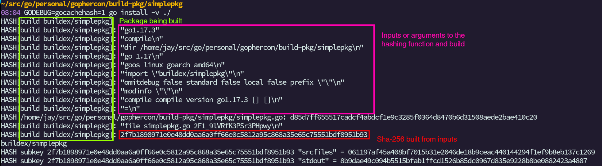
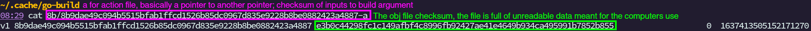
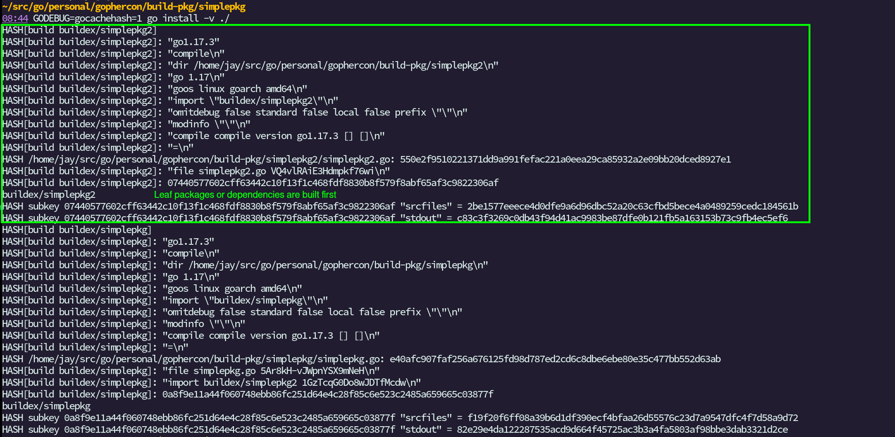
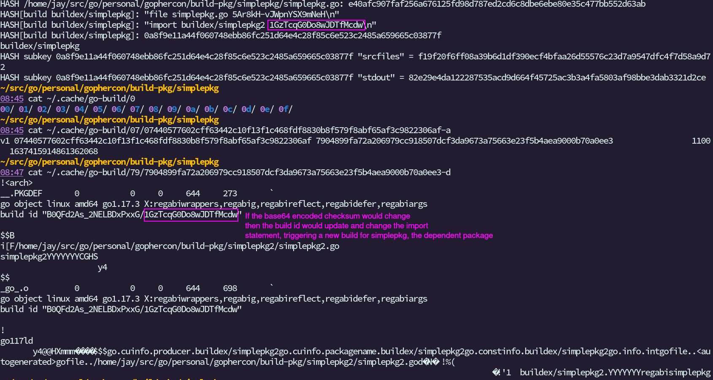

# Building Package in Go

- `GODEBUG=gocachehash=1 go install -v ./` -- see info on how pkg hashed
- `go env GOCACHE` -- find where your cache is

There are 256 directories in the build cache, for concurrent reads and writes.

## Hash formation

## Cache

## Building dependencies

## Recalculating builds

## Caching in CI (speeding up builds)

1. Load the cache from `go env GOCACHE`
1. Build binaries
1. Run the tests
1. Save the contents of `go env GOCACHE`
